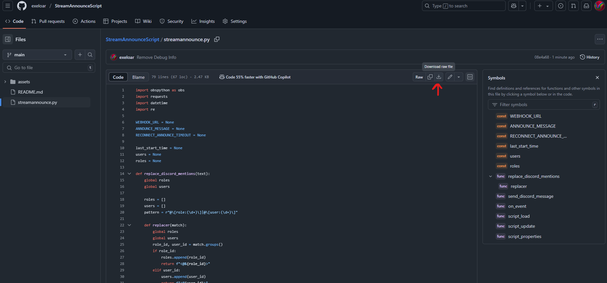

# Stream Announcement OBS Script

A script that uses Discord Webhooks and OBS scripting capabilities to automatically post an announcement message when you go live

Pros: (compared to existing bots)
- No delay for stream announcements
- Customizable delay so that you don't accidentally re-ping 100 times due to internet issues
- Directly in your OBS so it only relies on your computer and discord (no other middleman services that can go down, do breaking updates, etc.)

Cons:
- Potentially unclear installation guide (let me know!)

### Setup Guide
1. [Install python](https://www.python.org/downloads/)
2. Install dependencies (run command prompt as administrator and paste the line):

`path\to\python.exe -m pip install requests`

    ^ allows for websocket connection to discord

3. Download script
- Option 1: Download the script file directly (https://github.com/exeloar/StreamAnnounceScript/blob/main/streamannounce.py)

- Option 2: Download as ZIP and unzip

- Option 3: git clone
`git clone https://github.com/davis-matthew/StreamAnnounceScript.git`
4. Add script to OBS:

- Go to OBS->Tools->Scripts:

- Go to Python Settings set your python install path:

- Add Script to OBS

5. Create Discord Webhook:
- Go to Server Settings

- Integrations->Create Web Hook

- Rename & Edit the settings on the generated webhook (be sure to apply changes!)

- Once done, copy the webhook URL

6. Edit script parameters
- Set up your webhook parameters, message, and delay between notifications

- Your message can @ roles and users using the syntax (@[role:$roleid]) for a role, (@[user:$userid]) for a user. 

    Getting IDs:
    - Enable Developer Mode (user settings -> advanced)
    
    
    - Copy role ID
    
    - Copy user ID (right click user)

    